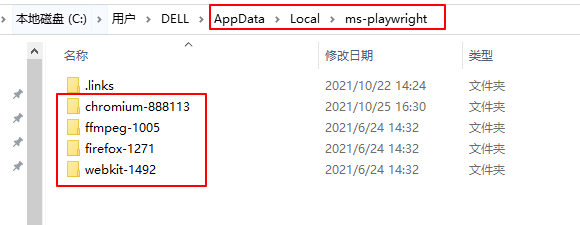
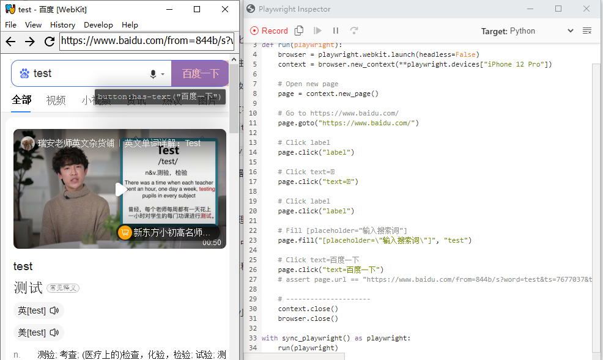

# Web自动化测试之playwright：概述


playwright是由微软开发的Web UI自动化测试工具， 支持Node.js、Python、C# 和 Java语言，本文将介绍playwright的特性以及它的简单使用。


## playwright特性

playwright具有以下特点： 

一、支持所有主流浏览器

- 支持所有主流浏览器：基于Chromium内核的Google Chrome 和 Microsoft Edge浏览器), WebKit内核的Apple Safari 和 Mozilla Firefox浏览器，不支持IE11。
- 跨平台：Windows、Linux 和macOS
- 可用于模拟移动端WEB应用的测试，不支持在真机上测试。
- 支持无头模式（默认）和有头模式


二、快速可靠的执行
- 自动等待元素
- Playwright基于Websocket协议，可以接受浏览器（服务端）的信号。selenium采用的是HTTP协议，只能客户端发起请求。
- 浏览器上下文并行：单个浏览器实例下创建多个浏览器上下文，每个浏览器上下文可以处理多个页面。
- 有弹性的元素选择：可以使用文本、可访问标签选择元素。

三、强大的自动化能力
- playwright是一个进程外自动化驱动程序，它不受页面内JavaScript执行范围的限制，可以自动化控制多个页面。
- 强大的网络控制：Playwright 引入了上下文范围的网络拦截来存根和模拟网络请求。
- 现代web特性：支持Shadow DOM选择，元素位置定位，页面提示处理，Web Worker等Web API。
- 覆盖所有场景：支持文件下载、上传、OOPIF（out-of-process iframes），输入、点击，暗黑模式等。

## 安装

Playwright有Node.js、Python、C# 和 Java语言版本，本文介绍Python版本的Playwright使用方法。

Playwright的Python版本仓库地址：[https://github.com/microsoft/playwright-python](https://github.com/microsoft/playwright-python)

官方文档地址：[https://playwright.dev/python/docs/intro](https://playwright.dev/python/docs/intro)

Playwright安装简单，pip安装时会自动下载浏览器驱动：

```bash
pip install playwright
playwright install # 安装支持的浏览器：cr, chromium, ff, firefox, wk 和 webkit
playwright install chromium # 安装指定的chromium浏览器
```

安装时会自动下载浏览器依赖，windows系统在`%USERPROFILE%\AppData\Local\ms-playwright` 路径下。




## 命令行工具

### 脚本录制

在命令行窗口使用如下语法格式进行脚本录制：

```bash
npx playwright codegen [options] [url]
```

options参数：

-   `-o, --output <file name> `  ：保存生成脚本
-   `--target <language>`  ：生成的脚本语言，可以设置javascript, test, python, python-async和csharp，默认为python。
-   `-b, --browser <browserType>`  ：要使用的浏览器，可以选择cr, chromium, ff, firefox, wk和webkit，默认chromium。
-   `--channel <channel>`：chromium版本，比如chrome, chrome-beta, msedge-dev等，          
-   `--color-scheme <scheme>`：模拟器的颜色主题，可选择light 或者 dark样式。      
-   `--device <deviceName>` ：模拟的设备，比如iPhone 11。
-   `--save-storage <filename>` ：保存上下文状态，用于保存cookies 和localStorage，可用它来实现重用。例如`playwright codegen --save-storage=auth.json`
-   `--load-storage <filename>` ：加载`--save-storage` 保存的数据，重用认证数据。     
-   `--proxy-server <proxy>` ：指定代理服务器
-   `--timezone <time zone>` ：  指定时区    
-   `--geolocation <coordinates>`  ：指定地理位置坐标   
-   `--lang <language>` ：指定语言/地区，比如中国大陆：zh-CN   
-  `--timeout <timeout>`  ：超时时间，定位毫秒，默认10000ms        
-   `--user-agent <ua string>`  ：用户代理   
-   `--viewport-size <size>`  ：浏览器窗口大小     
-   `-h, --help` ：查看帮助信息 

示例：模拟iPhone 12 Pro设备打开百度，使用Chromium驱动，生成的脚本语言设置为python，保存名称为test_playwright.py：

```bash
playwright codegen -o test_playwright.py --target python  -b chromium --device="iPhone 12 Pro" https://www.baidu.com/
```



对页面进行的操作会生成对应脚本代码。

### 打开网页

语法格式：
```bash
npx playwright open [options] [url]
```

除了没有 `-o` 和 `--target` options参数外，`playwright open` 支持 `playwright codegen` 的其它参数。


```bash
playwright open https://www.baidu.com/ # 默认使用Chromium打开
playwright wk https://www.baidu.com/ # 使用WebKit打开
playwright open --device="iPhone 12 Pro" https://www.baidu.com/ # 使用iPhone 12 Pro模拟器打开
```

### 截图
语法格式：

```bash
npx playwright screenshot [options] <url> <filename>
```
options参数和 `playwright codegen` 的选项类似，可以使用 `playwright screenshot --help` 命令查看。

```bash
playwright screenshot --device="iPhone 12 Pro" -b wk https://www.baidu.com/ baidu-iphone.png # 截取显示的页面
playwright screenshot --full-page --device="iPhone 12 Pro" -b wk https://www.baidu.com/ baidu-iphone-full-page.png # 截取当前全部页面
```

## 同步和异步API

Playwright支持同步和异步两种API，使用异步API需要导入asyncio库，它是一个可以用来实现Python协程的库，更详细介绍可参考[Python协程](https://blog.csdn.net/u010698107/article/details/117899540) 。

下面介绍如何使用python语言编写简单的playwright自动化脚本。

一共有2条测试用例，用例1步骤如下：
1. chrome浏览器打开百度
2. 搜索框输入“test”
3. 点击百度一下搜索
4. 点击搜索结果的第2页

用例2步骤：
1. chrome浏览器打开搜狗搜索
2. 搜索框输入“test”
3. 点击搜狗搜索
4. 点击搜索结果的第2页

**1、同步方式**

```python
import time
from playwright.sync_api import sync_playwright

def testcase1():
    print('testcase1 start')
    with sync_playwright() as p:
        browser = p.chromium.launch(headless=False)
        page = browser.new_page()
        page.goto("https://www.baidu.com/")
        print(page.title())
        page.fill("input[name=\"wd\"]", "test")
        page.click("text=百度一下")
        page.click("#page >> text=2")
        browser.close()
    print('testcase1 done')

def testcase2():
    print('testcase2 start')
    with sync_playwright() as p:
        browser2 = p.chromium.launch(headless=False)
        page2 = browser2.new_page()
        page2.goto("https://www.sogou.com/")
        print(page2.title())
        page2.fill("input[name=\"query\"]", "test")
        page2.click("text=搜狗搜索")
        page2.click("#sogou_page_2")
        browser2.close()
    print('testcase2 done')

start = time.time()
testcase1()
testcase2()
end = time.time()
print('Running time: %s Seconds'%(end-start))
```
执行结果：
```python
testcase1 start
百度一下，你就知道
testcase1 done
testcase2 start
搜狗搜索引擎 - 上网从搜狗开始
testcase2 done
Running time: 11.476110458374023 Seconds
```


**2、异步方式**

```python

import asyncio
import time

from playwright.async_api import async_playwright

async def testcase1():
    print('testcase1 start')
    async with async_playwright() as p:
        browser = await p.chromium.launch(headless=False)
        page = await browser.new_page()
        await page.goto("https://www.baidu.com/")
        print(await page.title())
        await page.fill("input[name=\"wd\"]", "test")
        await page.click("text=百度一下")
        await page.click("#page >> text=2")
        await browser.close()
    print('testcase1 done')

async def testcase2():
    print('testcase2 start')
    async with async_playwright() as p:
        browser2 = await p.chromium.launch(headless=False)
        page2 = await browser2.new_page()
        await page2.goto("https://www.sogou.com/")
        print(await page2.title())
        await page2.fill("input[name=\"query\"]", "test")
        await page2.click("text=搜狗搜索")
        await page2.click("#sogou_page_2")
        await browser2.close()
    print('testcase2 done')

async def main():
    task1 = asyncio.create_task(testcase1())
    task2 = asyncio.create_task(testcase2())
    tasks = [task1,task2]
    print('before await')
    await asyncio.gather(*tasks)

start = time.time()
asyncio.run(main())
end = time.time()
print('Running time: %s Seconds'%(end-start))
```

执行结果：
```python
before await
testcase1 start
testcase2 start
百度一下，你就知道
搜狗搜索引擎 - 上网从搜狗开始
testcase1 done
testcase2 done
Running time: 6.0248863697052 Seconds
```

可以看到，使用异步编程的方式可以显著提升测试效率。

## 浏览器
前面提到过，Playwright支持所有主流浏览器，下面介绍4种浏览器的启动方法：

```python
# chrome
browser = p.chromium.launch(channel="chrome", headless=False)
# Microsoft Edge
browser = p.chromium.launch(channel="msedge", headless=False)
# firefox
browser = p.firefox.launch(headless=False)
# webkit
browser = p.webkit.launch(headless=False)
```

## 浏览器上下文
在进行web自动化控制之前需要对浏览器进行实例化，比如：

```python
browser = p.chromium.launch(channel="chrome", headless=False)
```
browser是一个Chromium实例，创建实例其实是比较耗费资源的，Playwright支持在一个browser实例下创建多个浏览器上下文（BrowserContext），BrowserContext的创建速度很快，并且比创建browser实例消耗资源更少。对于多页面场景可以使用创建浏览器上下文的方式。
```python
import asyncio

from playwright.async_api import async_playwright

async def testcase1():
    print('testcase1 start')
    async with async_playwright() as p:
        browser = await p.chromium.launch(headless=False)
        page = await browser.new_page()
        await page.goto("https://www.baidu.com/")
        print(await page.title())
        await page.fill("input[name=\"wd\"]", "test")
        await page.click("text=百度一下")
        await page.click("#page >> text=2")

        context = await browser.new_context()
        page2 = await context.new_page()
        await page2.goto("https://www.sogou.com/")
        print(await page2.title())
        await page2.fill("input[name=\"query\"]", "test")
        await page2.click("text=搜狗搜索")
        await page2.click("#sogou_page_2")
        print(await page.title())
    print('testcase1 done')

asyncio.run(testcase1())
```
## 多页面
一个浏览器上下文可以有多个页面，也就是多个窗口。

```python
async def testcase2():
    print('testcase2 start')
    async with async_playwright() as p:
        browser = await p.chromium.launch(headless=False)
        context = await browser.new_context()
        page1 = await context.new_page()
        await page1.goto("https://www.sogou.com/")
        print(await page1.title())
        await page1.fill("input[name=\"query\"]", "test")
        await page1.click("text=搜狗搜索")
        await page1.click("#sogou_page_2")

        page2 = await context.new_page()
        await page2.goto("https://www.baidu.com/")
        print(await page2.title())
    print('testcase2 done')
```

## 断言
Python中可以使用assert 进行断言：

```python
assert page.title() == "百度一下，你就知道"
```
除了使用assert断言以外，还可以使用功能更加强大的断言方法Hamcrest ，具有丰富的断言匹配器。

Hamcrest文档：[https://pyhamcrest.readthedocs.io/en/v2.0.2/tutorial/](https://pyhamcrest.readthedocs.io/en/v2.0.2/tutorial/)

安装PyHamcrest：
```python
pip install PyHamcrest
```
```python
from hamcrest import *

assert_that(page.title(), equal_to("百度一下，你就知道"))
```


